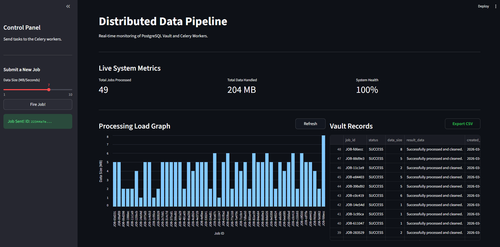
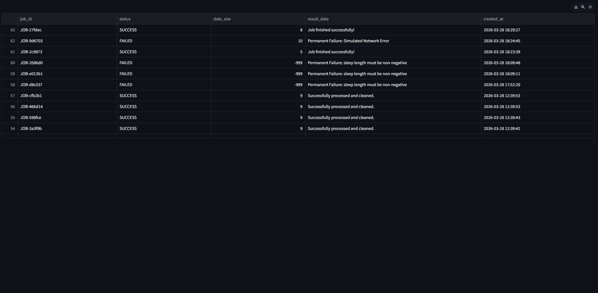
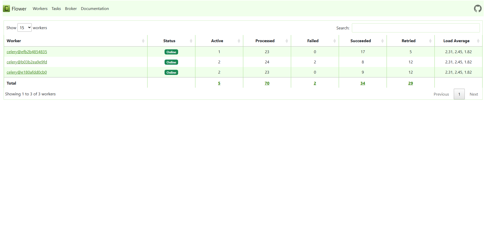
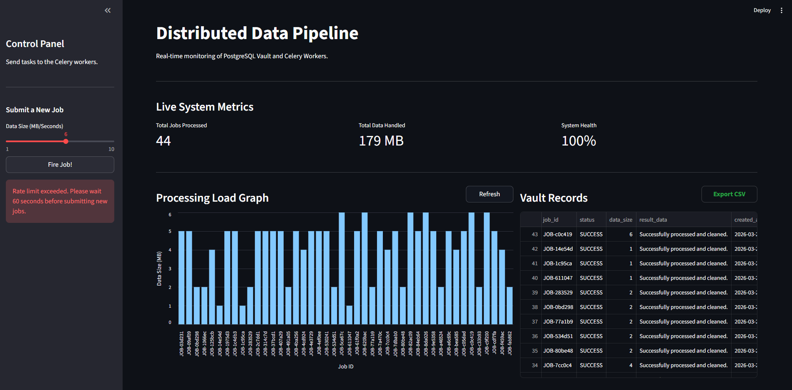
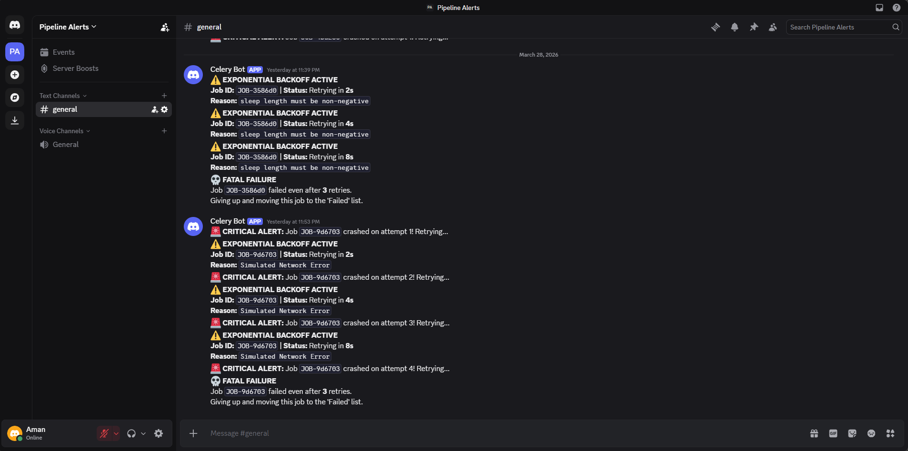
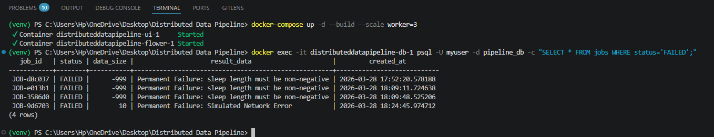
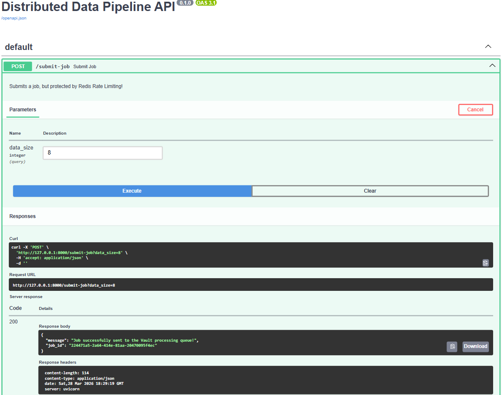

# 🚀 Distributed Data Pipeline: Resilience, Scalability & Monitoring

Hey! I’m Aman. I built this project to demonstrate how a production-grade data pipeline handles massive workloads while staying resilient. Instead of a simple script, I engineered a decoupled microservices architecture to ensure that no matter how hard the system crashes, your data remains safe in the "Vault."

## 🏗️ System Architecture & Data Flow

I designed this with a "fail-safe" mindset. Each component is isolated so that a crash in one node doesn't halt the entire pipeline.

    [Streamlit UI] ──(HTTP POST)──> [FastAPI Gateway]
                                         │
               ┌─────────────────────────┴─────────────────────────┐
               ▼                                                   ▼
        [Redis Cache]                                       [Redis Broker]
      (Rate Limiter/429)                                   (Task Distribution)
                                                                   │
                                                                   ▼
                                                         [Celery Workers (x3)]
                                                        (Distributed Execution)
               ┌───────────────────────────────────────────────────┴────────────────┐
               ▼                                                                    ▼
      [PostgreSQL Vault]                                                  [Auto-Retry Logic]
      (Success/DLQ Storage)                                               (Exponential Backoff)
                                                                                    │
                                                                                    ▼
                                                                            [Discord Alerts]
                                                                          (Fatal Failure Hook)

### 🛣️ The Request Lifecycle
1. **The Entry Point:** Jobs are submitted via the Streamlit dashboard or FastAPI Swagger.
2. **Safety First:** I’ve integrated Redis to enforce IP-based rate limiting to prevent API abuse.
3. **Fire & Forget:** FastAPI assigns a JOB-ID and pushes tasks to Redis, returning a response instantly to keep the gateway unblocked.
4. **Heavy Lifting:** 3 Scalable Celery Workers process tasks in parallel.
5. **Handling Chaos:** If a task hits a network snag, my logic triggers an Exponential Backoff strategy.
6. **The Vault (DLQ):** Results are saved in PostgreSQL. Permanent failures are routed to a Dead Letter Queue (DLQ) and fired to Discord.

---

## 📸 System Mastery (Visual Proof)

*Note: These are live captures from my development environment showing the system under load.*

### 1. Central Command Center
The Streamlit dashboard for real-time monitoring of processing loads and system health metrics.

### 2. The PostgreSQL Vault
A peek into the persistent storage where the system tracks every SUCCESS and FAILURE.

### 3. Distributed Worker Cluster (Flower)
Monitoring 3 concurrent worker nodes handling parallel execution to maximize throughput.

### 4. Smart Rate Limiting
Protection in action—this is what happens when the Redis-backed request limit is breached.

### 5. Resilience & Observability (Discord)
The automatic retry sequence (2s -> 4s -> 8s) before a Fatal Failure is logged.

### 6. Dead Letter Queue (DLQ) Audit
A direct SQL audit proving that every failed job is preserved for manual recovery.

### 7. Interactive API Blueprint
The FastAPI Swagger UI providing an interactive map for third-party integrations.

---

## 📂 Project Structure

Distributed-Data-Pipeline/
├── api/                 # FastAPI Gateway & Rate Limiting
│   ├── main.py          # Entry point & API Routes
│   └── database.py      # SQLAlchemy Models & DB Connection
├── worker/              # Distributed Task Execution (Celery)
│   ├── tasks.py         # Heavy logic, Backoff & Chaos Testing
│   └── celery_app.py    # Celery & Broker Config
├── ui/                  # Monitoring Dashboard (Streamlit)
│   └── app.py           # Real-time Metrics & Vault UI
├── assets/              # Live System Screenshots
├── docker-compose.yml   # Multi-container Orchestration
├── requirements.txt     # Environment Dependencies
└── .env.example         # Template for Discord Webhooks

---

## 🔥 Why This Pipeline is Robust

- **Fault Tolerance:** Uses an Exponential Backoff formula (2^n) to avoid overwhelming services during recovery.
- **Chaos Engineering:** I've built-in logic that simulates a 50% network failure rate to prove the system's resilience.
- **Zero Data Loss:** All failed tasks are captured in the Dead Letter Queue (PostgreSQL) with a full error trace.
- **Sub-Millisecond Caching:** Dashboard metrics are served from Redis RAM, bypassing heavy DB queries.
- **Scalable by Design:** Scale from 1 to 100+ workers by adjusting a single Docker parameter.

---

## 🚀 Get it Running Locally

1. **Clone & Setup**
git clone https://github.com/iamanpathak/Distributed-Data-Pipeline.git
cd Distributed-Data-Pipeline
cp .env.example .env # Add your Discord Webhook URL here

2. **Launch Infrastructure**
docker-compose up -d --build --scale worker=3

3. **Explore the Services**
- Dashboard: http://localhost:8501
- API Docs: http://localhost:8000/docs
- Worker Monitor: http://localhost:5555

<<<<<<< HEAD
### 4. Access the Services
* **Live Dashboard:** `http://localhost:8501`
* **API Swagger Docs:** `http://localhost:8000/docs`
* **Celery Task Monitor (Flower):** `http://localhost:5555`
=======
---
Developed with ❤️ by [Aman Pathak](https://github.com/iamanpathak)
>>>>>>> 8ce8ed5 (feat: finalize production-ready distributed pipeline with microservices orchestration and locked dependencies)
